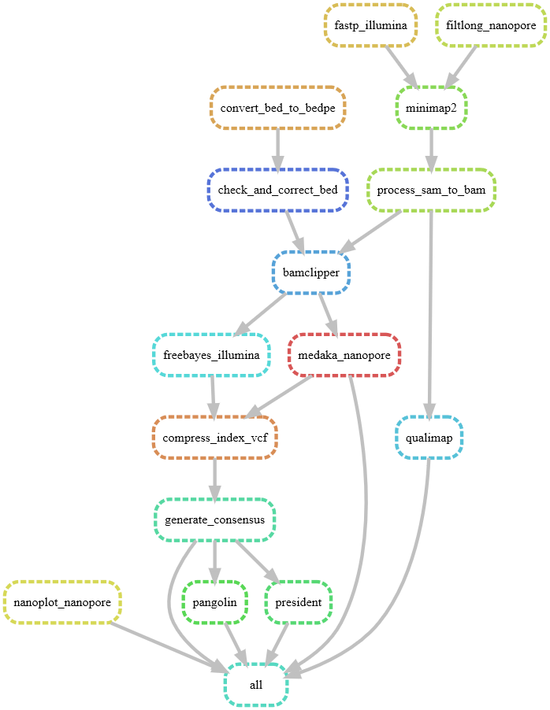

[](https://doi.org/10.5281/zenodo.15020719)

# Project 2 - SARS-CoV-2 genome assembly from Illumina & Nanopore data
#### Project 2 from SC2 @ FUB
#### Jule Brenningmeyer, Maximilian Otto

This repository contains a workflow to assemble the SARS-CoV-2 genome from Illumina and Nanopore data and finally compares the assembly quality between the two techniques.   
The workflow is based on Snakemake and uses Conda to manage the software dependencies.  
Besides assembling the genomes of the sample files, the workflow also performs quality control on the raw reads as well as on the assembled consensus sequences.  
To perform the assembly on both sequencing technologies, it is required, that the Illumina data is paired-end and the Nanopore data is single-end amplicon data. Additionally, the Illumina data needs to be demultiplexed and the Nanopore data needs to be basecalled.  
NOTE: "illumina" or "nanopore" should be included in the corresponding file names. The file naming convention this script is built upon can be derived from the example data set.    
The workflow is designed to be run on a Linux system with an active conda environment in which `snakemake` is installed and activated (`conda activate snakemake`).  

The presentation, including the results, can be found [here](https://docs.google.com/presentation/d/139hQzr9hJuHUSIcze_c5MqbzL4uuP447vb-4YYWZpiE/edit?usp=sharing).

## Workflow
The workflow consists of the following rules:




## Usage
### Environment

```bash

# download the repository to the current working directory using git 
git clone https://github.com/Scaramir/Covid-Assembly.git

cd Covid-Assembly/
```

### Example Data

```bash

mkdir data

# Illumina and nanopore data
wget --no-check-certificate https://osf.io/yz4ad/download -O data/sc2-nanopore-illumina-reads.tar.gz
tar -xzvf data/sc2-nanopore-illumina-reads.tar.gz -C data/

# Reference data
wget "https://www.ncbi.nlm.nih.gov/sviewer/viewer.fcgi?id=NC_045512.2&db=nuccore&report=fasta&retmode=text&withmarkup=on&tool=portal&log$=seqview&maxdownloadsize=1000000" -O data/NC_045512.2.fasta

# Python Script to Convert bed to bedpe files
mkdir scripts
wget --no-check-certificate https://osf.io/3295h/download -O scripts/primerbed2bedpe.py

# primer scheme folder
mkdir data/primer_scheme

# Illumina
# Download the primer BED scheme
# V3
wget https://raw.githubusercontent.com/artic-network/artic-ncov2019/master/primer_schemes/nCoV-2019/V3/nCoV-2019.scheme.bed -O data/primer_scheme/V3-nCoV-2019.scheme.bed

# Nanopore
# First, we download the primer BED scheme
# ARTIC V4.1 primer kit
wget https://raw.githubusercontent.com/artic-network/artic-ncov2019/master/primer_schemes/nCoV-2019/V4.1/SARS-CoV-2.scheme.bed -O data/primer_scheme/V4.1-SARS-CoV-2.scheme.bed

# ! ATTENTION ! remove the files starting with "._" from the data folder
rm data/*/**/._*

```

### Run
To run the workflow, you need to have `snakemake` installed and activate before you can execute it like so:
```bash
snakemake --cores 16 --use-conda
```
Set `cores` to the maximum number of threads you want to Snakemake to distribute jobs to.   
Most jobs use 4 threads, so 16 cores should be fine.

To perform quality control using FastQC for Illumina data, additional to fastp,just run snakemake like this: 
```bash
snakemake --cores 16 --use-conda -p fastqc_illumina
```
